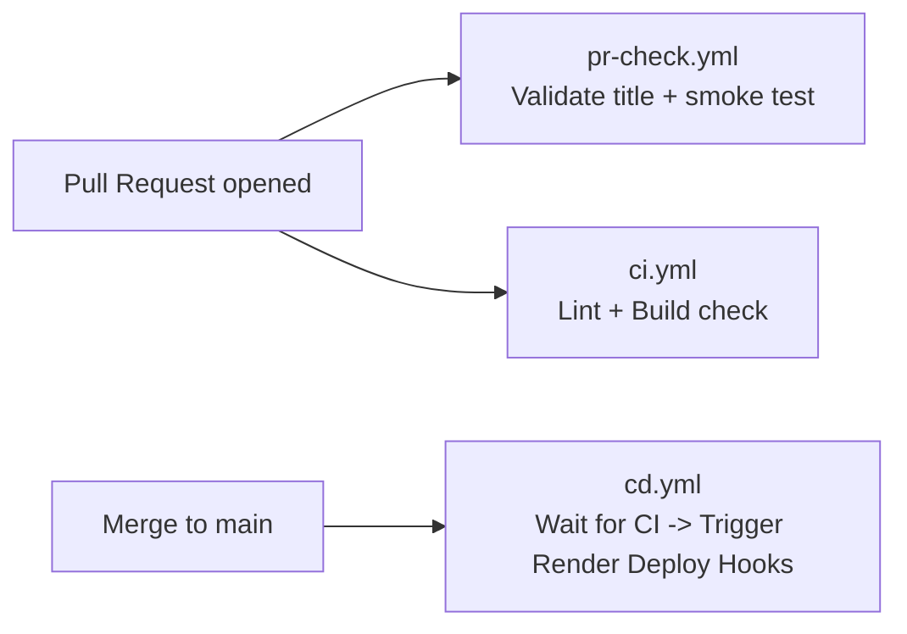

# GitHub Actions CI/CD — Dataset Analyser (Render.com)

Three workflow files were created under `.github/workflows/`.

---

## Pipeline Overview

---

## Workflows

### 1. `ci.yml` — Continuous Integration
**Triggers:** Every push to `main` / `develop`, every PR.

| Job | What it does |
|-----|-------------|
| **Frontend** | `npm ci` → `npm run lint` → `npm run build` |
| **Backend** | `pip install` → `ruff check backend/` |
| **Docker** | Builds both images in GitHub to ensure standard configurations are healthy |

---

### 2. `cd.yml` — Continuous Deployment (Render)
**Triggers:** Runs automatically **only if** `ci.yml` passes successfully on the `main` branch.

| Job | What it does |
|-----|-------------|
| **deploy** | Pings the **Render Deploy Hooks** using `curl` to tell Render to fetch the new code and build/deploy it. This guarantees Render only deploys code that has already passed GitHub Actions tests! |

---

### 3. `pr-check.yml` — PR Quality Gate
**Triggers:** Every PR opened / updated against `main` or `develop`.

| Job | What it does |
|-----|-------------|
| **validate-title** | Enforces [Conventional Commits](https://www.conventionalcommits.org/) format (`feat:`, `fix:`, `docs:`, etc.) |
| **smoke-test** | Installs both frontend and backend deps, then verifies `backend/main.py` imports cleanly |

---

## ⚙️ How to Setup with Render

Since Render handles its own container building and hosting, we just need to use **Deploy Hooks** to tell it when it's safe to update!

### Step 1 — Turn OFF Auto-Deploy in Render
By default, Render auto-deploys immediately when you push code to GitHub. But we want it to wait for our GitHub Actions CI tests to pass first!
1. Go to your Render Dashboard.
2. Open your Backend service → **Settings** → **Auto-Deploy**. Change it to `No`.
3. Open your Frontend service → **Settings** → **Auto-Deploy**. Change it to `No`.

### Step 2 — Copy your Deploy Hooks
1. In your Render Backend service → **Settings** → **Deploy Hook**. Copy the URL.
2. In your Render Frontend service → **Settings** → **Deploy Hook**. Copy the URL.

### Step 3 — Add Secrets to GitHub
Go to **GitHub → Your Repo → Settings → Secrets and variables → Actions → New repository secret**.

Add these two secrets exactly:

| Secret Name | Value |
|---|---|
| `RENDER_DEPLOY_HOOK_BACKEND` | The Backend Deploy Hook URL you copied (e.g. `https://api.render.com/deploy/srv-...`) |
| `RENDER_DEPLOY_HOOK_FRONTEND` | The Frontend Deploy Hook URL you copied (e.g. `https://api.render.com/deploy/srv-...`) |

### Step 4 — Verify
Push a new commit to `main`.
1. GitHub Actions will start the `Continuous Integration` workflow.
2. Once that goes green ✅, it will automatically start the `CD — Deploy to Render` workflow.
3. The CD workflow will hit your Webhooks, and you will see your services spinning up in the Render Dashboard!