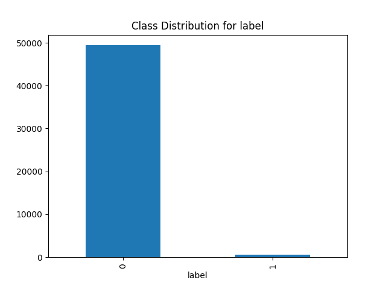
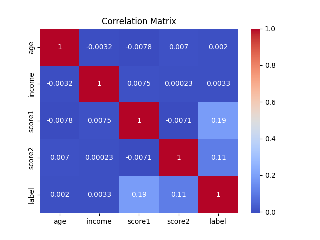
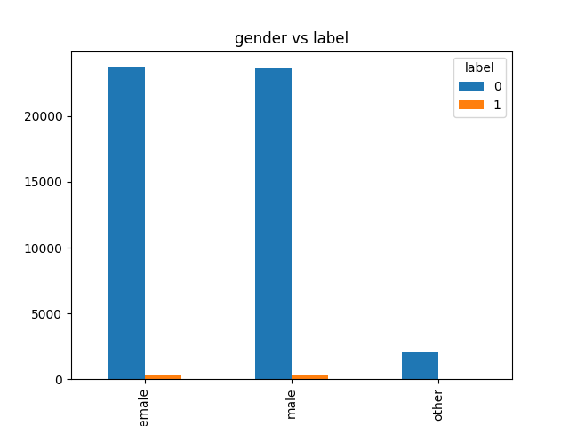
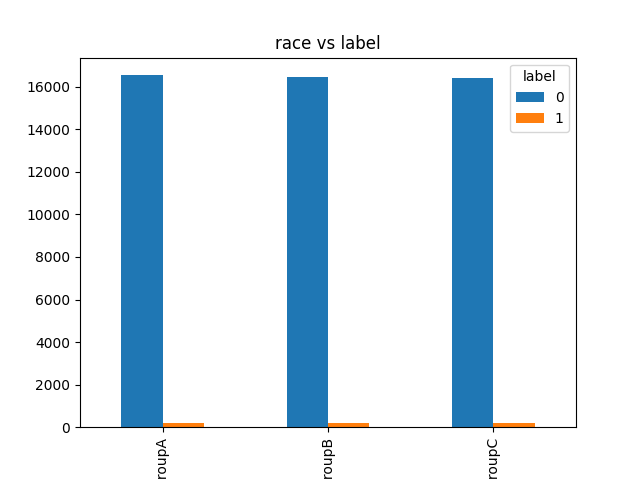
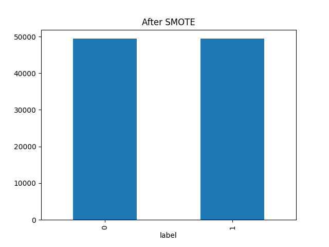

# CSV Bias & SMOTE Analysis Platform

A full-stack web application that:
- Accepts CSV datasets
- Automatically detects target variables
- Performs bias analysis
- Applies SMOTE for class imbalance
- Generates fairness-weighted datasets
- Returns downloadable output files

---

## Live Demo

- **Web App:**  
   https://dataset-bias-analyser.onrender.com

- **Sample Dataset:**
   [dataset.csv](public/dataset.csv)

- **Sample Output:**

   [bias_report.txt](public/bias_report.txt) | 
   [smote_test.csv](public/smote_test.csv) | 
   [smote_train.csv](public/smote_train.csv) | 
   [weighted_gender.csv](public/weighted_gender.csv) | 
   [weighted_race.csv](public/weighted_race.csv)

   
   
   
   
   
   
---

## Tech Stack
- **Frontend:** Next.js (App Router) + Tailwind CSS
- **Backend:** FastAPI + Pandas
- **ML:** Scikit-learn, Imbalanced-learn (SMOTE)
- **Infrastructure:** Docker, Docker Compose
- **Hosting:** Render
- **Architecture:** Monorepo (frontend + backend)

---

## Features
- CSV upload via web UI
- Automatic target variable detection
- Dataset bias analysis
- SMOTE-based class balancing
- Fairness-aware sample weighting
- Downloadable processed output files
- Stateless backend with per-upload isolation

---

## Deployment

- Frontend and backend are deployed as **separate Render Web Services**
- Both services are sourced from the **same GitHub repository**
- Backend URL is injected into frontend using environment variables

---

## Run with Docker (Containerization)

The easiest and recommended way to run the full application stack is using Docker Compose. This method ensures consistent environments and simplifies setup:

```bash
# Make sure Docker Desktop / Docker Engine is running
docker-compose up --build
```

- **Frontend Web App:** http://localhost:3000
- **Backend API:** http://localhost:8000

To stop the containers, use `Ctrl+C` and then optionally run `docker-compose down` to clean up.

---

## Run Locally (Manual Setup)

### 1. Prerequisites

Before running the project locally without Docker, ensure the following are installed on your machine:

- System Tools
- Git
- Node.js (v16+ recommended)
- Python 3.10+
- npm or yarn
- pip
  
### 2. Clone the repository
```bash
git clone https://github.com/ookieCoder/Dataset-Analyser.git
cd Dataset-Analyser
```
### 3. Backend Setup

Create a Python Virtual Environment
```bash
cd backend
python -m venv venv
```

Activate Virtual Environment
```bash
# macOS / Linux
source venv/bin/activate

# Windows
venv\Scripts\Activate
```

### 4. Install Dependencies
```bash
pip install -r requirements.txt
```
```bash
npm install
```

### 5. Running the Application Locally
**Start the Backend**
```bash
uvicorn main:app --reload --host 0.0.0.0 --port 8000
```
Backend will run at: http://localhost:8000

**Start the Frontend**
- Open a new terminal, from the root project directory:
```bash
npm run dev
```
Frontend will run at http://localhost:3000

### 6. Usage

- Open your browser to http://localhost:3000
- Upload a CSV dataset
- Select or confirm the target variable
- Initiate analysis
- Review bias metrics and processed output (SMOTE)
- Download partitioned/balanced files


